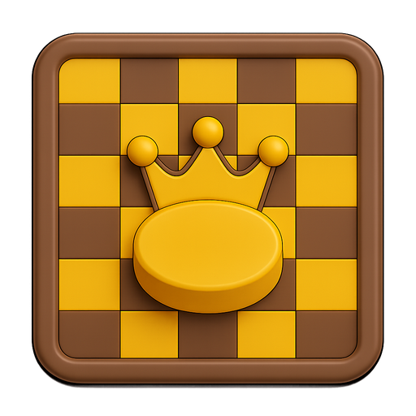

# Dam Haji - Traditional Malaysian Board Game

  
   
  <em>A digital adaptation of the traditional Malaysian checkers game</em>
    
  
    
  
  
  

## 🎮 About Dam Haji

Dam Haji is a traditional Malaysian board game similar to international checkers, but with unique rules that make it distinctively Malaysian. This digital adaptation preserves the cultural heritage while providing a modern, accessible gaming experience.

### 🚀 Quick Start
**Ready to play?** [Click here to start playing immediately!](https://bizzkoot.github.io/Dam-Haji/)

### 🌟 Key Features

- **Traditional Rules**: Faithfully implements authentic Malaysian Dam Haji gameplay
- **AI Opponent**: Three difficulty levels (Easy, Medium, Hard) with intelligent move selection
- **Modern UI**: Complete responsive redesign for optimal user experience
- **Progressive Web App (PWA)**: Install on desktop and mobile devices
- **Offline Support**: Play without internet connection
- **Cross-Device Compatible**: Seamless experience on desktop, tablet, and mobile
- **Performance Optimized**: Smooth gameplay with no browser slowdowns
- **Modular Architecture**: Clean, maintainable codebase for future enhancements
- **Cultural Preservation**: Maintains the essence of traditional Malaysian gaming

### 📸 Game Screenshots

  
  &nbsp;&nbsp;&nbsp;
  
   
  <em>Gameplay on desktop and mobile devices</em>

## 🎯 Game Rules

### Basic Setup
- **Board**: 8x8 checkered board (like chess/checkers)
- **Pieces**: 12 pieces per player (Black vs White)
- **Starting Position**: Black pieces on top 3 rows, White pieces on bottom 3 rows

### Movement Rules

#### Regular Pieces
- Move diagonally forward only
- Black pieces move downward (increasing row numbers)
- White pieces move upward (decreasing row numbers)
- One square at a time

#### Haji (King) Pieces
- Promoted when a piece reaches the opponent's back row
- Can move diagonally in any direction (forward and backward)
- Can move multiple squares in one turn
- Represented with a crown symbol

### Capture Rules

#### Mandatory Captures
- **Forced Captures**: If a capture is possible, it MUST be taken
- **Multiple Captures**: A piece can continue capturing in the same turn
- **No Return**: Cannot return to the original position during multi-capture

#### Capture Mechanics
- **Regular Pieces**: Jump over opponent piece to land on empty square
- **Haji Pieces**: Can capture over long distances, jumping multiple squares
- **Path Validation**: Must land on empty square, cannot jump over own pieces

## 🔄 Movement Logic

### Regular Piece Movement

### Capture Logic

### Haji Movement

## 🎮 How to Play

### Getting Started
1. **Open the Game**: Launch in a modern web browser (Chrome, Edge, Firefox, Safari)
2. **Choose Mode**: 
   - **Player vs Player**: Two human players
   - **Player vs AI**: Play against computer opponent
3. **Select Difficulty**: If playing vs AI, choose Easy, Medium, or Hard
4. **Start Playing**: Black moves first

### Game Controls
- **Select Piece**: Click on your piece to highlight available moves
- **Make Move**: Click on highlighted square to move
- **Deselect**: Click selected piece again to deselect
- **Reset Game**: Use the reset button to start a new game

### Win Conditions
- **Capture All Opponent Pieces**: Eliminate all enemy pieces
- **Block Opponent**: Leave opponent with no legal moves
- **Draw**: No captures for 50 consecutive moves

## 🚀 PWA Features

### Live Deployment
The game is hosted on GitHub Pages and available at: **[https://bizzkoot.github.io/Dam-Haji/](https://bizzkoot.github.io/Dam-Haji/)**

### Installation
1. Open the game in a PWA-compatible browser (Chrome, Edge)
2. Look for the "Install" button in the address bar or browser menu
3. Click "Install" to add to your desktop/mobile home screen
4. The app will open in a standalone window without browser UI

### Offline Support
1. Install the PWA as described above
2. Disconnect from the internet
3. Launch the installed app
4. The game will load and be fully playable offline

## 🛠️ Technical Details

### Architecture
- **Frontend**: Vanilla JavaScript, HTML5, CSS3
- **AI Engine**: Minimax algorithm with alpha-beta pruning
- **PWA**: Service Worker for offline functionality
- **State Management**: Pure JavaScript with reactive updates

### AI Implementation
- **Easy**: Basic move evaluation, prioritizes captures
- **Medium**: Enhanced positional understanding, values Haji pieces
- **Hard**: Advanced tactics, multiple move planning, endgame mastery

### Performance Features
- **Responsive Design**: Adapts to any screen size
- **Smooth Animations**: 60fps piece movements and captures
- **Memory Efficient**: Optimized for long gaming sessions
- **Cross-Platform**: Works on desktop, tablet, and mobile

## 🐛 Recent Fixes

### Critical Bug Resolutions
- ✅ **Haji Capture Logic**: Fixed long-distance capture detection
- ✅ **Forced Capture AI**: AI now properly implements mandatory capture rules
- ✅ **Multi-Capture Validation**: Prevents illegal capture sequences
- ✅ **Position Tracking**: Accurate piece position after moves
- ✅ **Stalemate Detection**: Proper game ending when no moves available

## 🌏 Cultural Significance

Dam Haji is more than just a game—it's a piece of Malaysian cultural heritage. Traditionally played with bottle caps or shells on a hand-drawn board, this digital adaptation preserves the authentic rules while making the game accessible to a global audience.

### Traditional Materials
- **Board**: Often drawn on cardboard or wood
- **Pieces**: Bottle caps, shells, or small stones
- **Crown**: Stacked pieces or marked pieces for Haji

## 📚 Documentation

Comprehensive documentation is available for developers, designers, and contributors:

- **[📋 Documentation Index](docs/README.md)** - Complete documentation overview
- **[🚀 Implementation Summary](docs/implementation/UI_OVERHAUL_IMPLEMENTATION_SUMMARY.md)** - UI overhaul details and achievements  
- **[🏗️ Technical Architecture](docs/implementation/TECHNICAL_ARCHITECTURE.md)** - System architecture and design patterns
- **[🔧 Development Process](docs/development/)** - Phase-by-phase development documentation
- **[🎮 Game Rules](docs/development/GAME_RULES.md)** - Complete game mechanics and rules

### For Developers
- **Architecture Overview**: See [Technical Architecture](docs/implementation/TECHNICAL_ARCHITECTURE.md)
- **Code Organization**: Check [Implementation Summary](docs/implementation/UI_OVERHAUL_IMPLEMENTATION_SUMMARY.md#modular-javascript-architecture)
- **Performance Notes**: Review optimization strategies in technical docs

## 🤝 Contributing

This project aims to preserve and promote traditional Malaysian games. Contributions are welcome, especially:
- Bug reports and fixes
- UI/UX improvements  
- Additional game variations
- Documentation improvements
- Cultural context additions

Please refer to the [documentation](docs/README.md) for technical details and architecture information.

## 📄 License

This project is open source and available under the MIT License.

---

  <em>Preserving Malaysian gaming heritage through modern technology</em>

